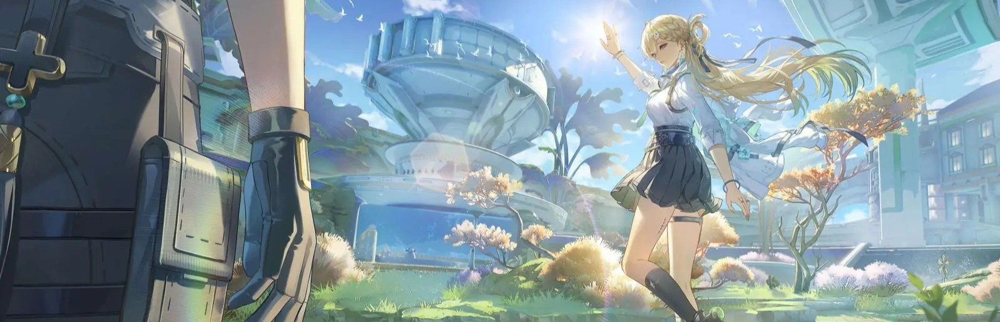
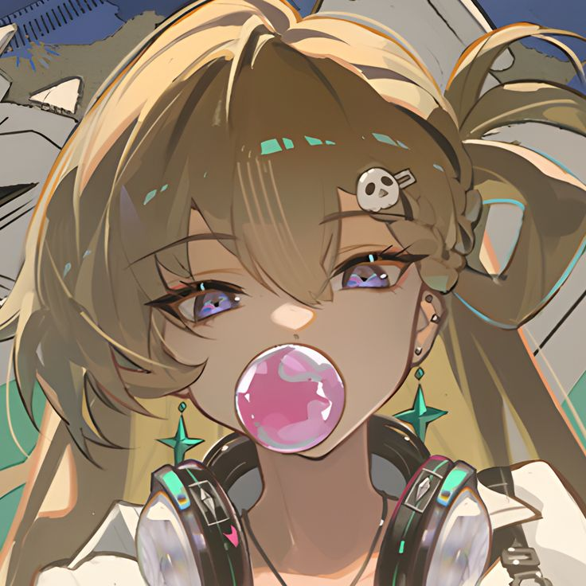
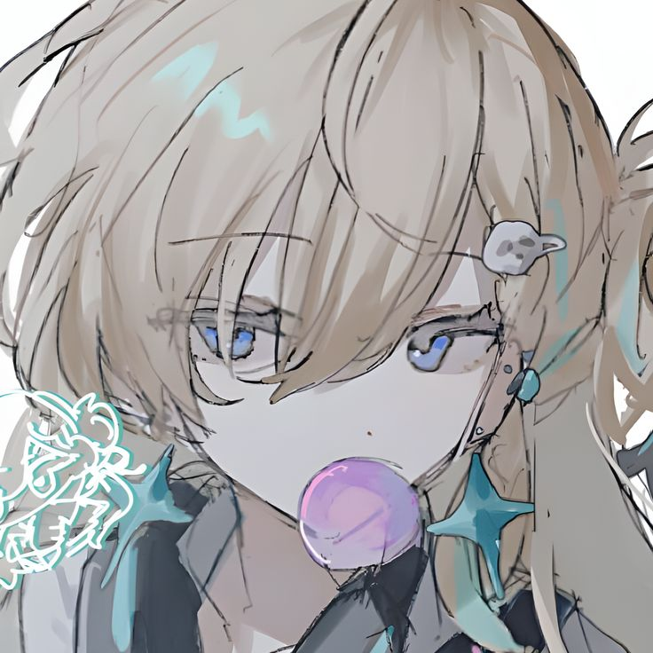
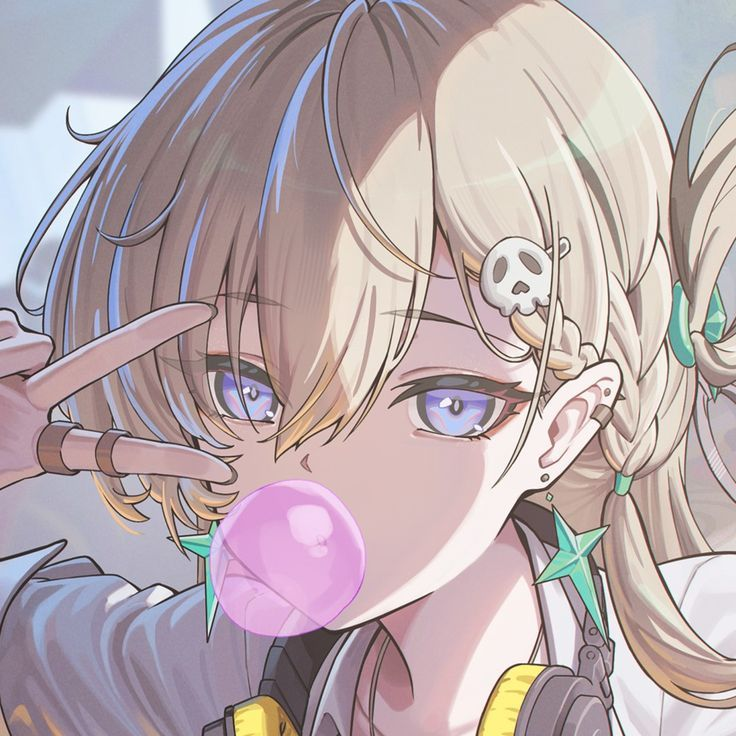

<p align="center">
  
</p>

<a href="https://discord.com/users/948524546321973258"></a>

### Hi!👋 I'm Dafi

*A student who enjoys turning ideas into working code.*

## **☕ About me**
<a href="https://github.com/Dayy4dev"></a>
- Name: **Dafi**
- Interested in: **Web Development, IoT, Android, and Game Projects**
- Currently: **Learning, experimenting, and breaking things (on purpose)**
- Language: **Indonesian, English, Japanese**
<br><br>

## **💻 Skills**
<a href="https://github.com/Dayy4dev">
  <picture>
    <source media="(max-width: 767px)" srcset="./images/spacer.png">
    
  </picture>
</a>

### 💻 Web Development


### 📱 Mobile & IoT


### 🎮 Game & 3D


### 🎨 Design & Creative


### 🛠️ DevOps & Tools


<br clear="all">

## **📊 Github Stats**
<p align="center">
  
  
</p>

<p align="center">
  
</p>

## **🎧 Music**
<p align="center">
<a href="https://open.spotify.com/user/31kpyy2yfwsqaqcag432tyewxlf4"></a>
</p>

<!-- 
## **🧋 Cutie Counter**
<a href="https://discord.com/users/948524546321973258"></a>

```yaml
People who visit my profile :3.

Hehe~ another cutie has been caught.
```
-->
## **📫 Contact**
<a href="https://github.com/Dayy4dev"></a>
**Fastest way to reach me:** [Discord - dafi](https://discord.com/users/948524546321973258)

**Or email me:** dafi.ristiansyah@gmail.com

**Also here:** [Instagram - daff.fx](https://instagram.com/daff.fx) · [Web - rexd.my.id](https://rexd.my.id)

<a href="https://github.com/Meghna-DAS/github-profile-views-counter"></a>
[](https://github.com/Dayy4dev)
[](https://discord.com/users/948524546321973258)
[](https://instagram.com/daff.fx)
[](https://rexd.my.id)
[](mailto:dafi.ristiansyah@gmail.com)
